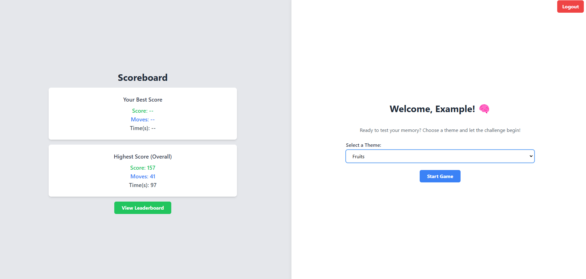
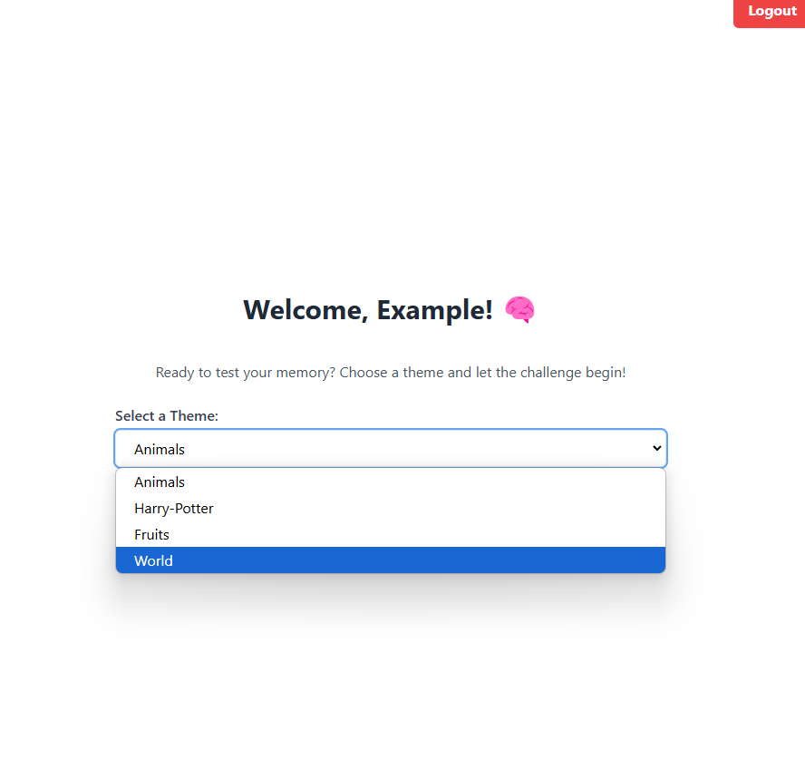
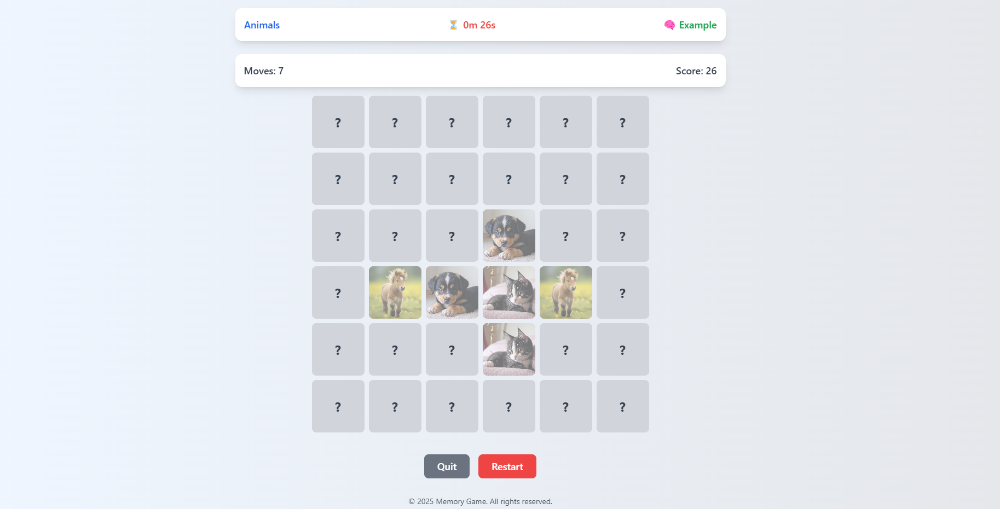
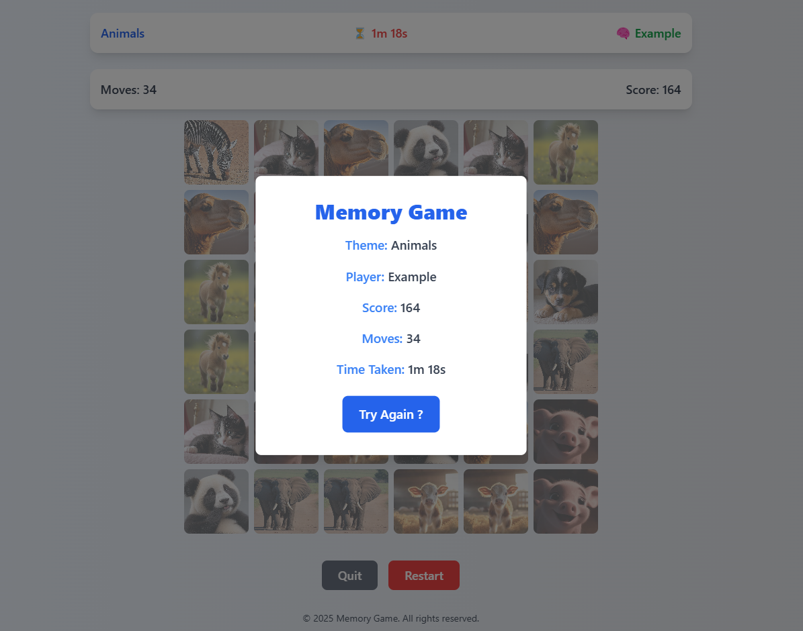
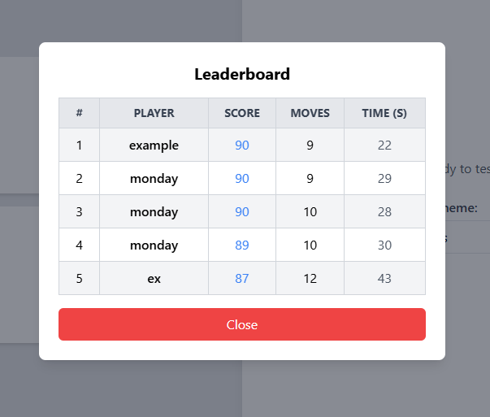

# **Memory Game - Full Stack Setup Guide**  

This document provides a step-by-step guide to setting up the **Memory Game** project, including backend and frontend installation, project structure, and a detailed description of the webpage flows.  

## **Project Overview**  

The Memory Game is a **full-stack web application** where users can select a theme, play a memory-matching game, track their scores, and view a leaderboard. It includes:  
✅ **Frontend:** Built with React.js and Tailwind CSS  
✅ **Backend:** Built with Node.js, Express.js, and MongoDB
✅ **Authentication:** JWT-based authentication  
✅ **Data Storage:** User details, scores, and themes stored in a database  


# **1️⃣ Backend Setup**  

### **📌 Requirements**  
Ensure you have the following installed:  
- **Node.js** (LTS version recommended)  
- **MongoDB** (for data storage)  
- **Git** (for version control)  

### **📌 Installation Steps**  

#### **1. Clone the Repository**  
```shell
git clone <repository-url>
cd backend
```

#### **2. Install Dependencies**  
```shell
npm install
```

#### **3. Set Up Environment Variables**  
Create a `.env` file in the `backend/` directory and add:  
```ini
PORT=5000
MONGO_URI=<your-mongodb-connection-string>
JWT_SECRET=<your-secret-key>
```

#### **4. Start the Server**  
```shell
npm start
```
The backend will run on `http://localhost:5000/`  

#### **5. Running Tests**  
```shell
npm test
```


# **2️⃣ Frontend Setup**  

### **📌 Requirements**  
Ensure you have:  
- **Node.js** (LTS version)  
- **Vite** (for a fast development server)  

### **📌 Installation Steps**  

#### **1. Navigate to the Frontend Directory**  
```shell
cd frontend
```

#### **2. Install Dependencies**  
```shell
npm install
```

#### **3. Tailwind CSS Installation**  

Uninstall previous versions:  
```shell
npm uninstall tailwindcss postcss autoprefixer
```

Install Tailwind CSS v3:  
```shell
npm install -D tailwindcss@3 postcss autoprefixer
```

Initialize Tailwind:  
```shell
npx tailwindcss init -p
```

#### **4. Configure Tailwind CSS**  

**Modify `tailwind.config.js`:**  
```js
export default {
  content: ["./index.html", "./src/**/*.{html,js,ts,jsx,tsx}"],
  theme: {
    extend: {},
  },
  plugins: [],
};
```

**Modify `index.css` (remove everything and add):**  
```css
@tailwind base;
@tailwind components;
@tailwind utilities;
```

#### **5. Start the Frontend Development Server**  
```shell
npm run dev
```
The frontend will run on `http://localhost:5173/`

# **3️⃣ Webpage Flows & Description**  

### **📌 Authentication Page (`Auth.jsx`)**  
- Users can **Sign Up** or **Log In** securely.  
- Authentication is handled via JWT.  
- Once logged in, users are redirected to the **Home Page**.

<p float="left">
  
  
</p>


### **📌 Home Page (`Home.jsx`)**  
- Users see a welcome screen.  
- Can select a game theme from the available options.
- Can check it's previous and highest score for the theme selected.
- Button to **Start Game** after selecting a theme.  
- Navigation to **Leaderboard**
- Button to Logout, user will redirect to **Auth Page**.

<p float="left">
  
  
</p>

### **📌 Game Page (`Game.jsx`)**  
- The **6x6 grid** of cards appears based on the selected theme.  
- Players **flip cards** to match pairs.  
- Score, moves, and time are tracked.
- For every right match, user gets **+10**, else **-1** 
- Once all pairs are matched, a **summary page** appears.  
- Button to **restart the game** or **return to home**.
<p float="left">
  
</p>

### **📌 Scoreboard Component (`Scoreboard.jsx`)**  
- Displays the **real-time score** of the user.  
- Shows **moves taken** and **time elapsed**.
<p float="left">
  
</p>

### **📌 Leaderboard Page (`Leaderboard.jsx`)**  
- Displays **top scores** by theme.  
- Fetches and displays the highest scores.  
- Users can **filter** scores by different themes.
<p float="left">
  
</p>

### **✅ Summary**  
- **Backend**: Node.js + Express + MongoDB/PostgreSQL  
- **Frontend**: React.js + Tailwind CSS  
- **Game Features**: User authentication, real-time game tracking, leaderboard  
