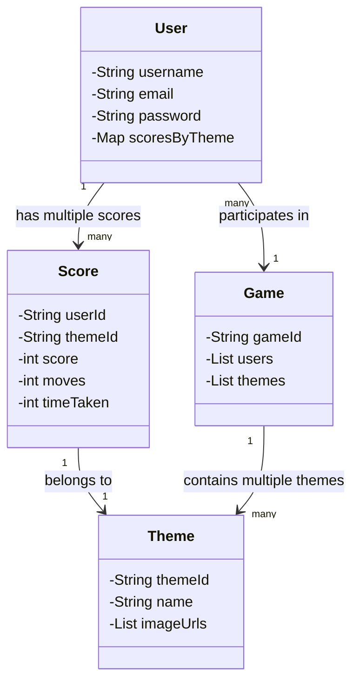

# **📜 Memory Game - Backend**  

## **📌 Requirements**  

### ✅ **Functional Requirements**  
1. Users should be able to **register** and **log in** securely.
2. Users can **start a new game** by selecting a theme.
3. The backend should store **scores and game details** for each user.
4. Users should be able to **retrieve their highest scores** for a theme.
5. Users should be able to see the **top players** (leaderboard).
6. The system should track **moves, time taken, and scores** for each game.
7. The backend should **validate user authentication** before allowing gameplay.
8. Users should be able to **fetch all available game themes**.

### 🔧 **Non-Functional Requirements**
1. **Performance**: The API should respond in less than 500ms for most requests.
2. **Scalability**: Should handle multiple concurrent users efficiently.
3. **Security**: Implement **JWT authentication**, encrypt passwords.
4. **Reliability**: API should be robust, handling errors properly.
5. **Data Storage**: Use **MongoDB/PostgreSQL** to persist game scores and user data.
6. **Logging**: Implement logging for debugging and tracking requests.
7. **Testing**: Ensure at least **80% test coverage** with unit and integration tests.
8. **Deployment**: Should be deployable via **Docker & Kubernetes (TBD)**.

## **🛠 Backend Objects & Classes**
The backend follows an **MVC (Model-View-Controller) architecture**:
- **Models**: Define database schema (`User`, `Score`, `Game`, `Theme`).
- **Services**: Handle business logic.
- **Controllers**: Handle API requests.
- **Routes**: Define API endpoints.

## **📌 UML Class Diagram**  



---

## **📁 File Structure**  
```
📦 backend/
 ┣ 📂 __tests__/                # Unit & Integration Tests
 ┃ ┣ 📜 gameService.test.js
 ┃ ┣ 📜 scoreService.test.js
 ┃ ┣ 📜 themeService.test.js
 ┃ ┗ 📜 userService.test.js
 ┣ 📂 src/
 ┃ ┣ 📂 config/                # Configurations (DB, environment variables)
 ┃ ┣ 📂 controllers/           # Handles API requests
 ┃ ┃ ┣ 📜 authController.js    # Login, register
 ┃ ┃ ┣ 📜 gameController.js    # Game-related APIs
 ┃ ┃ ┣ 📜 scoreController.js   # Score-related APIs
 ┃ ┃ ┗ 📜 themeController.js   # Theme-related APIs
 ┃ ┣ 📂 middlewares/           # Middleware for auth, validation
 ┃ ┣ 📂 models/                # Database schemas
 ┃ ┃ ┣ 📜 Game.js
 ┃ ┃ ┣ 📜 Score.js
 ┃ ┃ ┣ 📜 Theme.js
 ┃ ┃ ┗ 📜 User.js
 ┃ ┣ 📂 routes/                # API Routes
 ┃ ┃ ┣ 📜 authRoutes.js
 ┃ ┃ ┣ 📜 gameRoutes.js
 ┃ ┃ ┣ 📜 scoreRoutes.js
 ┃ ┃ ┗ 📜 themeRoutes.js
 ┃ ┣ 📂 services/              # Business logic
 ┃ ┃ ┣ 📜 authService.js
 ┃ ┃ ┣ 📜 gameService.js
 ┃ ┃ ┣ 📜 scoreService.js
 ┃ ┃ ┗ 📜 themeService.js
 ┃ ┣ 📂 utils/                 # Utility functions (Token, encryption)
 ┃ ┣ 📜 app.js                 # Main app entry point
 ┃ ┣ 📜 jest.config.js          # Jest configuration for testing
 ┃ ┣ 📜 package.json           # Dependencies
 ┃ ┗ 📜 .env                   # Environment variables
 ┣ 📂 scripts/                  # Scripts for deployment & database migration
 ┗ 📜 README.md                 # Documentation
```

---

## **Summary**
This backend:
✅ Uses **Node.js, Express, and MongoDB**  
✅ Implements **JWT authentication**  
✅ Uses **MVC architecture**  
✅ Includes **unit tests**  
✅ Follows **best practices** for scalability & performance  
