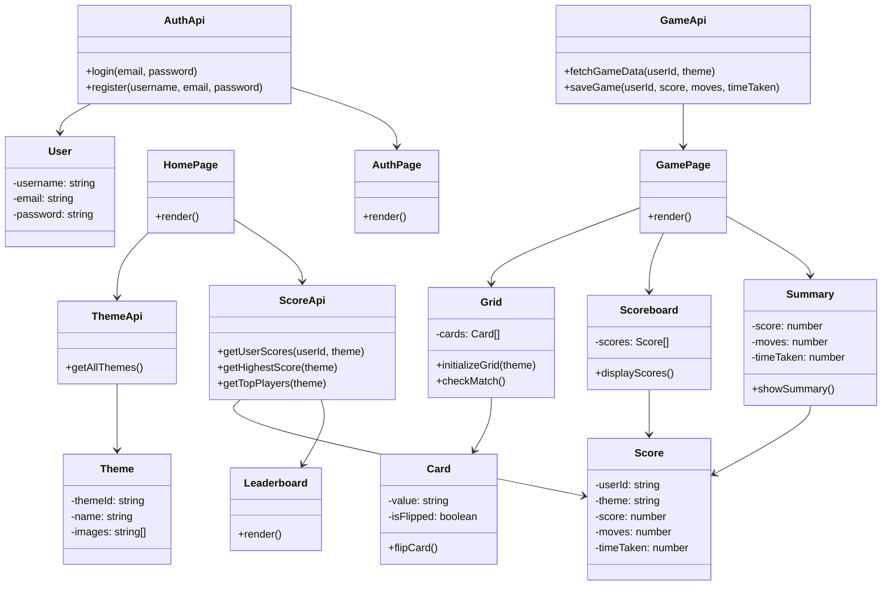

# **Memory Game - Frontend** 

## **Requirements**
### **Functional Requirements**
- Users should be able to register and log in.
- Users can select a game theme (e.g., Animals, Fruits, Countries).
- The game board should be generated dynamically based on the selected theme.
- The game should display a 6x6 grid of cards.
- Clicking on a card reveals its content.
- Matching pairs should remain visible; unmatched cards should hide after a delay.
- The game should track the score, moves, and time taken.
- A summary screen should appear when the game is completed.
- A scoreboard should display the highest scores.
- Users should be able to view the leaderboard.

### **Non-Functional Requirements**
- The UI should be responsive across devices.
- Fast rendering of UI components using React.js and Tailwind CSS.
- Secure API communication with JWT authentication.
- Code should follow best practices and be well-structured for maintainability.
- Performance optimizations for smooth gameplay.
- Accessible UI for all users.

### **Frontend Components & API Structure**  
The frontend is built using **React.js** with the following structure:  

- **API Layer**: Handles communication with the backend (`authApi`, `gameApi`, `scoreApi`, `themeApi`).  
- **Components**: Reusable UI elements (`Card`, `Grid`, `Scoreboard`, `Summary`).  
- **Pages**: Core views (`Auth`, `Game`, `Home`, `Leaderboard`).  
- **State Management**: Uses **React Context API** for global state.  


## **UML Class Diagram**
Frontend class structure and its relationship with the backend:



---

## **File Structure**
```
frontend/
│── dist/                     # Production build output
│── node_modules/             # Dependencies
│── public/
│   ├── assets/
│   │   ├── images/           # Game images/icons
│── src/
│   ├── api/                  # API calls to backend
│   │   ├── authApi.jsx
│   │   ├── gameApi.jsx
│   │   ├── scoreApi.jsx
│   │   ├── themeApi.jsx
│   ├── components/           # Reusable UI components
│   │   ├── Card.jsx
│   │   ├── Grid.jsx
│   │   ├── Scoreboard.jsx
│   │   ├── Summary.jsx
│   ├── context/              # React Context API (if needed)
│   ├── pages/                # Main pages of the app
│   │   ├── Auth.jsx
│   │   ├── Game.jsx
│   │   ├── Home.jsx
│   │   ├── Leaderboard.jsx
│   ├── App.css               # Global styles
│   ├── App.jsx               # Main React component
│   ├── index.css             # Tailwind CSS styles
│   ├── main.jsx              # Entry point
│── .gitignore
│── eslint.config.js          # ESLint configuration
│── index.html                # HTML template
│── package-lock.json
│── package.json              # Project dependencies
│── postcss.config.js         # PostCSS configuration
│── README.md                 # Documentation
│── tailwind.config.js        # Tailwind CSS configuration
│── vite.config.js            # Vite configuration
```

---

## **File Structure Explanation**
### **1. `api/` (API Calls)**
- `authApi.jsx` → Handles authentication API calls (login, register).
- `gameApi.jsx` → Manages game-related API requests (fetching game data, saving game progress).
- `scoreApi.jsx` → Fetches scores and leaderboards from the backend.
- `themeApi.jsx` → Fetches available themes.

### **2. `components/` (UI Components)**
- `Card.jsx` → Represents a single memory card.
- `Grid.jsx` → Manages the game board (6x6 grid of cards).
- `Scoreboard.jsx` → Displays player scores.
- `Summary.jsx` → Shows game results after completion.

### **3. `pages/` (Application Pages)**
- `Auth.jsx` → Login and Registration page.
- `Game.jsx` → Core game UI (grid, scoreboard, summary).
- `Home.jsx` → Theme selection screen.
- `Leaderboard.jsx` → Displays the top players.

### **4. `styles/` (CSS Files)**
- `App.css` → Global styles.
- `index.css` → Tailwind-specific styles.

### **5. `main.jsx` & `App.jsx`**
- `main.jsx` → The entry point of the React app.
- `App.jsx` → The root component that sets up routes and renders pages.

### **6. Configuration & Others**
- `.gitignore` → Files to ignore in Git.
- `package.json` → Project dependencies.
- `vite.config.js` → Configuration for Vite (build tool).
- `tailwind.config.js` → Tailwind CSS configuration.

---

## **Summary**  
- Uses **React.js with Vite** for fast builds  
- Implements **JWT authentication** for secure login  
- Follows **modular architecture** with reusable components  
- Designed for **performance and scalability**  